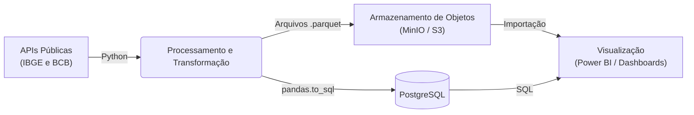

# Pipeline ETL: IPCA e Metas de Inflação

Este repositório contém a infraestrutura e os scripts responsáveis pela extração, transformação e carga (ETL) de dados do IPCA (IBGE) e das Metas de Inflação (Banco Central do Brasil). O projeto é desenvolvido em Python, com foco em eficiência, manutenibilidade e arquitetura desacoplada.

## 🏗️ Arquitetura

O pipeline foi projetado para extrair dados de fontes governamentais abertas, processá-los utilizando `pandas` e armazená-los no formato otimizado `.parquet` em um bucket compatível com S3 (como o MinIO).



### Componentes Principais

- **Fontes de Dados**:
  - **IBGE (SIDRA)**: Tabela 7060 (Grupos, Hierarquia, Municípios) e Tabela 1737 (Série Histórica).
  - **Banco Central (SGS)**: Série 13521 (Metas de Inflação).
- **Processamento**:
  - Scripts modulares independentes para cada fonte.
  - Tipagem estrita e transformações estruturais (limpeza, pivotagem, padronização de datas).
- **Armazenamento**:
  - Dados salvos em arquivos `.parquet`, garantindo compressão eficiente e preservação de tipos de dados.
  - Upload automatizado para bucket via `boto3`.
  - Carga das tabelas no **PostgreSQL** via `SQLAlchemy` / `pandas.to_sql` (full refresh).

## 📁 Estrutura do Projeto

```text
.
├── .env.example            # Exemplo de variáveis de ambiente
├── requirements.txt        # Dependências do projeto
├── README.md               # Documentação do projeto
└── src/                    # Scripts Python de extração e carga
    ├── ipca_7060_grupos.py
    ├── ipca_7060_hierarquia.py
    ├── ipca_7060_rm_municipios.py
    ├── ipca_serie_historica.py
    ├── meta_inflacao.py
    ├── orquestrador.py     # Script principal para execução do ETL
    ├── upload_minio.py     # Módulo para envio de arquivos ao MinIO (S3)
    └── upload_postgres.py  # Módulo para carga das tabelas no PostgreSQL
```

## 🚀 Como Executar

### Pré-requisitos

- Python 3.8+
- Instância MinIO ou bucket AWS S3 configurado.
- Instância PostgreSQL acessível (ex: container Docker).

### 1. Configuração do Ambiente

Instale as dependências listadas no `requirements.txt`:

```bash
pip install -r requirements.txt
```

Crie um arquivo `.env` na raiz do projeto (utilize o `.env.example` como referência) contendo as credenciais do seu bucket:

```env
MINIO_ENDPOINT=http://seu-ip-ou-dominio:9000
MINIO_ACCESS_KEY=sua_access_key
MINIO_SECRET_KEY=sua_secret_key
MINIO_BUCKET_NAME=nome-do-bucket

PG_HOST=seu-ip-ou-dominio
PG_PORT=5432
PG_DATABASE=postgres
PG_USER=postgres
PG_PASSWORD=sua_senha
PG_SCHEMA=public
```

### 2. Execução do ETL

Para rodar todo o pipeline de extração e processar os dados localmente:

```bash
python src/orquestrador.py
```

### 3. Upload para o S3/MinIO

Após a execução do orquestrador, envie os arquivos processados para o bucket executando:

```bash
python src/upload_minio.py
```

### 4. Carga no PostgreSQL

Para carregar os arquivos `.parquet` processados em tabelas do PostgreSQL (cada arquivo vira uma tabela, com full refresh a cada execução):

```bash
python src/upload_postgres.py
```

## 🛠️ Padrões de Desenvolvimento

- **Desacoplamento**: Lógica de ETL separada em funções especialistas (`_extrair`, `_transformar`, `_carregar`).
- **Segurança**: Uso de `python-dotenv` para evitar a exposição de credenciais.
- **Confiabilidade**: Logging nativo estruturado para monitoramento.
- **Tipagem Estrita**: Uso de `type hints` para maior legibilidade e previsibilidade do código.
